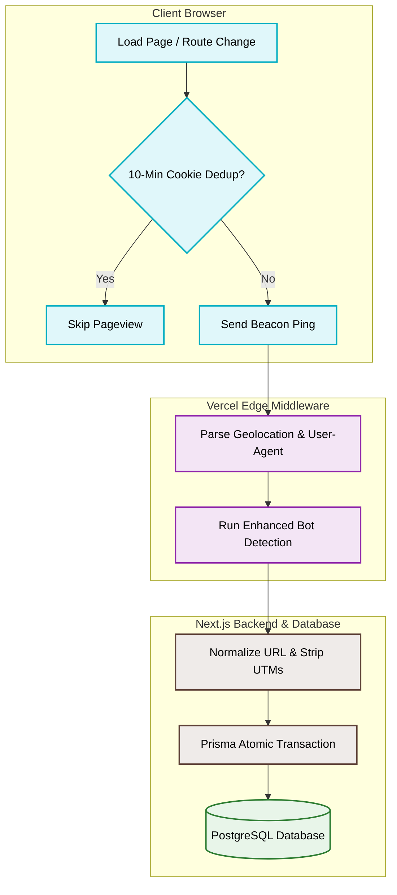

# Pageview Analytics


**Simple analytics, powerful insights** - Privacy-focused pageview tracking with multiple integration options.

Modern analytics without the tracking baggage. Track pageviews without tracking users. Minimal cookies (10-min deduplication only), no user profiling, maximum transparency.

✨ **Features**

- 🚀 Fast & lightweight tracking script
- 🔒 Privacy-first (no user profiling or persistent cookies)
- ⚡ Real-time monitoring with WebSocket updates
- 📊 Advanced analytics dashboard
- 🔌 Multiple integration options: Script embed, REST API, or backend push
- 🌍 Geo-location and device insights
- 📱 Responsive design with dark mode
- 🔓 Open source and transparent


## How It Works

This project provides high-performance, privacy-focused pageview analytics through an optimized three-tier process:



1. **Lightweight Client-side Tracking (`pageview.js`):** Client websites load a dynamically generated tracking script. To keep it privacy-first, the script uses a temporary (10-minute) cookie to deduplicate pageviews and transmits data using the non-blocking `navigator.sendBeacon` API. It also hooks into modern SPA routing (`history.pushState` / `popstate`).
2. **Edge-level Enrichment (`middleware.ts`):** Requests are intercepted at the Vercel Edge. The middleware enriches request metrics with client geolocation data (country, city) and parses browser/device capabilities, plus applies robust bot detection before passing the data to the API.
3. **Normalized Database Storage (`/api/pageview`):** The API normalizes incoming URLs (stripping promotional UTM tags). It runs an atomic `prisma.$transaction` using the `connectOrCreate` pattern to deduplicate metadata fields (hosts, slugs, browsers, cities) and records the pageview cleanly into PostgreSQL.

## Quick Start

Add this snippet to your website:

```html
<script>
  !(function (e, n, t) {
    e.onload = function () {
      let e = n.createElement('script')
      ;((e.src = t), n.body.appendChild(e))
    }
  })(window, document, 'https://pageview.duyet.net/pageview.js')
</script>
```

Checkout result at: https://pageview.duyet.net

## Development

To run the development server, execute the following command:

```bash
npm run dev
# or
yarn dev
# or
pnpm dev
```

Open [http://localhost:3000](http://localhost:3000) with your browser to see the result.

## Contribute and deployment

To contribute to the project, push any changes to the `dev` branch and create a PR to merge the changes into the `main` branch.
Preview deployment can be seen on the `dev` branch.

For deployment on Vercel, follow these links for instructions:

- https://www.prisma.io/docs/guides/database/using-prisma-with-planetscale
- [Next.js deployment documentation](https://nextjs.org/docs/deployment).

## Project note

Disclaimer: This project is not intended for scale and is for personal usage only.
I may consider scaling it later on.
The main purpose of this project is to demonstrate how to use Next.js,
PlanetScale, TurboRepo, Vercel and some modern React components.

## License

MIT.
